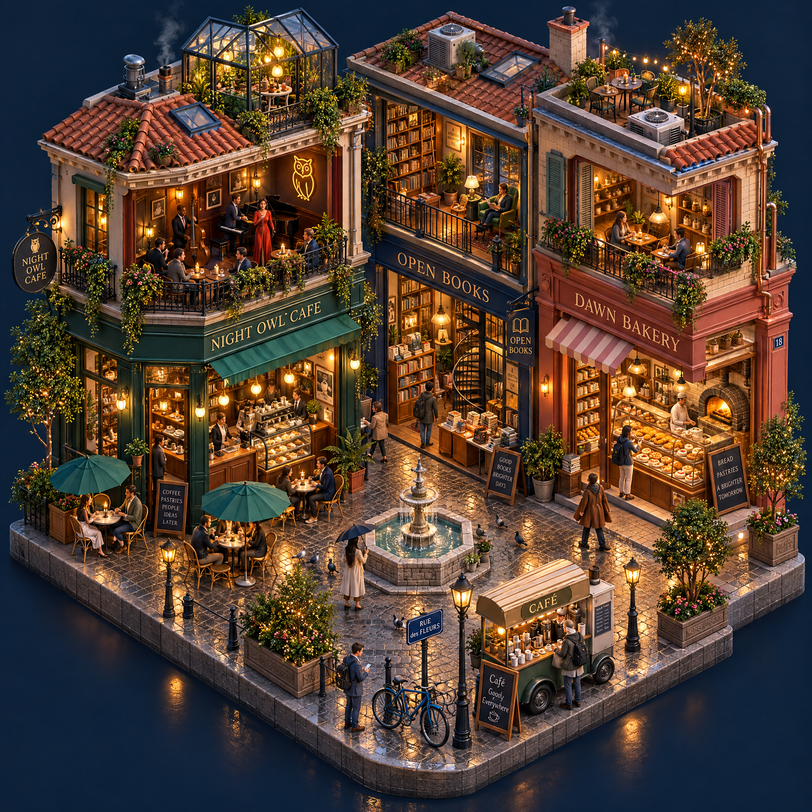

# 📐 Isometric

Range: No. 54–55 · Count: 2

Load this file only when the request matches this category. For cross-cutting writing rules, pair it with `craft.md`.

### No. 54 · Isometric miniature cafe district

- Image: `docs/isometric/isometric-cafe.png`

  
- Metadata: Isometric · `square` · `1024x1024` · Author: EvoLinkAI · Source: [GitHub archive](https://github.com/EvoLinkAI/awesome-gpt-image-2-prompts)

```text
A detailed isometric 3D miniature scene of a two-block cafe district, clean geometric forms, precise 30° isometric perspective alignment. A corner cafe with outdoor umbrella seating, a bookstore next door with stacks of books visible through the window, a bakery with a window display of pastries, a bicycle parked at the curb, a small fountain in a mini-plaza, planter boxes with tiny trees, a food cart on the corner selling coffee, stylised miniature pedestrians in various poses, tiled roof tops with ventilation details. Soft ambient lighting from upper-left, no harsh shadows, pastel-plus-muted palette (terracotta rooftops, cream walls, sage greens, dusty blue accents), slight atmospheric haze, subtle ambient occlusion in corners, high-detail miniature texturing. Professional rendering quality, suitable for editorial or marketing materials. Flat colored background in a single soft cream tone, no ground plane shadow, scene floating like a diorama.
```

- Sunburst cutaway adaptation: `docs/isometric/cafe-cutaway-sunburst.png`

  
- Output metadata: `gpt-image-2.5-sunburst` · `high` · `2048x2048` · `2026-09-09` · `/v1/images/edits`
- Input reference: `docs/isometric/isometric-cafe.png` · Author: EvoLinkAI · Source: [GitHub archive](https://github.com/EvoLinkAI/awesome-gpt-image-2-prompts)
- Adapted edit prompt: Curated

```text
Use the reference image as the layout anchor for a richly detailed isometric two-block cafe district at blue hour. Keep the street footprint, corner cafe, neighboring bookstore, bakery and fountain plaza recognizable. Transform it into a three-storey architectural cutaway diorama with coherent 30-degree isometric geometry.

Open the front-facing walls to reveal the cafe espresso bar and upstairs jazz lounge; bookshelves, reading nooks and a spiral staircase in the bookstore; pastry cases and a working oven in the bakery. Add a rooftop glass greenhouse, tiny terraces, copper plumbing, tiled stairs, balconies, hanging plants and warm lights visible through rain-speckled windows. At street level show wet cobbles, bicycles, the coffee cart, varied miniature pedestrians and reflections around the fountain. Every floor, doorway and staircase should connect plausibly.

Use warm amber interiors against deep teal evening shadows, tactile brick, glazed tiles, glass and brushed brass. Preserve crisp detail throughout the scene, with a clean dark navy background and room around the floating diorama. Give the scene depth through cutaway rooms and layered architecture. Use restrained, readable storefront lettering: "NIGHT OWL CAFE", "OPEN BOOKS", and "DAWN BAKERY". Keep the composition square and visually balanced.
```

- Visual QA: The main street layout, fountain and three requested shop names remain clear. Cutaway rooms, jazz lounge, spiral staircase and rooftop greenhouse appear. The result has two enclosed storeys plus roof space, short of the requested three enclosed storeys.
- Run evidence: [Sunburst sample runs](../../../docs/sunburst-samples.md).

### No. 55 · Isometric fantasy village map

- Image: `docs/isometric/isometric-fantasy-village.png`

  
- Metadata: Isometric · `square` · `1024x1024` · Author: Unknown · Source: [Reddit](https://www.reddit.com/r/midjourney/comments/1hkqr4x/isometric_maps_prompts_included/)

```text
Create a vibrant isometric fantasy village map with a clean grid-based layout using 3x3 meter tiles. Include wooden houses with thatched roofs, cobblestone paths, and a central stone fountain. One corner of the map rises into a small grassy hill about 2 meters high with stairs connecting to the lower ground. Keep the isometric angle precise and game-ready. Warm sunlight sends clear rays and long shadows across the rooftops. Make the scene readable like a handcrafted strategy-game map, with crisp tile logic, charming environmental detail, and rich but controlled color.
```
